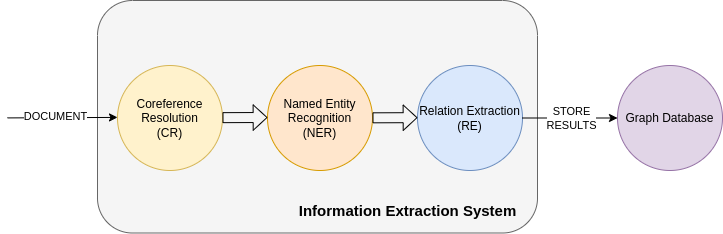

# Information Extraction
Recently, data is very helpful. From data, we can mining value and build very application.
With motivation, in this project we build a tool about information extraction filed. 
It can extract information in a text and detect relation between them.

We design system follow by pipeline architecture with 3 component:



- Corefence Resolution
- Named Entity Recognition
- Relation Extraction


---
# 1. Setup
### Install requirements
```commandline
pip install -r requirements.text
```
### Install docker
You can install docker by following:
- docker: [link](https://docs.docker.com/engine/install/ubuntu/)
- docker-compose: [link](https://docs.docker.com/compose/install/)

### Export python path:
```commandline
export PYTHONPATH=./
```
---
# 2.Run
### 2.1 Start neo4j database
Neo4j uses a property graph database model. A graph data structure consists of nodes (discrete objects) that can be connected by relationships.
We use neo4j to save iformation after extraction.
```commandline
sudo docker-compose up
```
## 2.2 Run service
### 2.2.1 Setup config 
Setup config pipeline at file: `api/configs/pipeline_config.yaml`:
```yaml
VERSION: v0.0.1

LANGUAGE: en

GENERAL:
  model_dir: ./models

PIPELINE:
  COREF: null
  NER:
    name: BertNER
    package: src.tagger.BertNER
    params:
      model_name_or_path: models/bert-ner
      max_seq_length: 256
  REL:
    name: BertRelCLF
    package: src.relation_extraction.BertRelCLF
    params:
      model_name_or_path: models/bert-rel
      max_seq_length: 256
```
A system pipeline has 3 component: Coref, Ner and Rel. You can set name and package that are specific for each component.
If set is null then that component is not used.

Now, we support models for each component by following:
- ner: 
  - BertNer (src.tagger.BertNER)
  - LstmNER (src.tagger.LstmNER)
- rel:
  - BertRelCLF (src.relation_extraction.BertRelCLF)

We trained each model with Conll2004 dataset you can download from [here](https://drive.google.com/drive/folders/1SkaKD4bqYj4sc_WrJva17zkHJf4vKz5Z?usp=sharing).
After you have downloaded, you unzip and set params `model_name_or_path` to file path of each model folder.

### 2.2.2 Run service
Run service with commandline (run at root project):
```bash
export PYTHONPATH=./

cp template.env .env 

uvicorn app:app --reload --debug
```

After you have run, you can visit `http://localhost:8000/docs` to try service

---
# 3. How to use with code
## 3.1 Neo4j Database
### Create a relation:
```python
from src.db_api.Neo4jDB import Neo4jDB
from src.schema.schema import Relation, Entity

db = Neo4jDB(
    uri="neo4j://localhost:7687",
    user="neo4j",
    password="160199"
)

s_e = Entity(entity="Per", value="Nguyen Van A")
t_e = Entity(entity="Loc", value="Ha Noi")
rel_type = "Live_In"
r = Relation(source_entity=s_e, target_entity=t_e, relation=rel_type)
db.create_relationship(r)
results = db.query_relation_entities(s_e)
for record in results:
    print(record)
```
After add relation to database, you can check in : http://localhost:7474/browser/ with clause:
```
MATCH (p:Per {value: "Nguyen Van A"}) return p
```

## 3.2 Named Entity Recognition
- Use BertNER
```python
from src.tagger.BertNER import BertNER

model_name_or_path = "models/bert-ner"
ner = BertNER(model_name_or_path=model_name_or_path)

text = "My name is Tung"
out = ner.run(text)
print(out)
```

- Use LstmNER
```python
from src.tagger import LstmNER

model_name_or_path="models/lstm-ner"
ner = LstmNER.from_pretrained(model_name_or_path=model_name_or_path)

text = "I Love Anna Marry"
output = ner.run(text=text)
print(output)
```

## 3.3 Relation Extraction
- Use BertRelCLF
```python
from src.relation_extraction.BertRelCLF import BertRelCLF
from src.data_reader import CoNLLReader

model_name_or_path = "models/bert-rel"


model = BertRelCLF(model_name_or_path=model_name_or_path)

text = "In Indiana , downed tree limbs interrupted power in parts of Indianapolis ."
entities = [{'entity': 'Loc', 'value': 'In', 'start_token': 0, 'end_token': 1},
            {'entity': 'Loc', 'value': ',', 'start_token': 2, 'end_token': 3}]

print(text)
out = model.run(text=text, entities=entities)
print(out)
```

## 3.4 Pipeline
- Use InfoExPipeline
```python
from src.pipelines.InfoExPipeline import InfoExPipeline
from src.utils.utils import load_yaml

config_path = "configs/pipeline_config.yaml"
config = load_yaml(config_path)
pipeline = InfoExPipeline.from_confg(config["PIPELINE"])
text = "My name is Tung , I study at Standford"
output = pipeline.run(text)
print(output)
```

You can play around example in folder example. We provide example code to run and train each component

---
# 4. References
CoNLL04 data: [link](https://cogcomp.seas.upenn.edu/Data/ER/)

